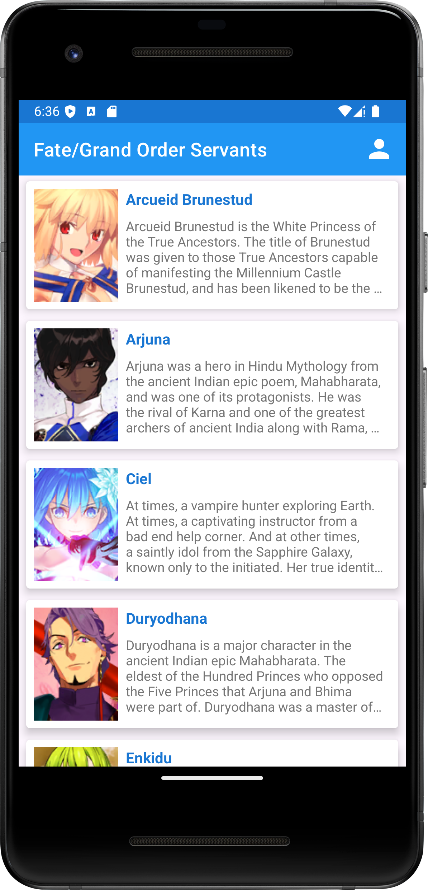
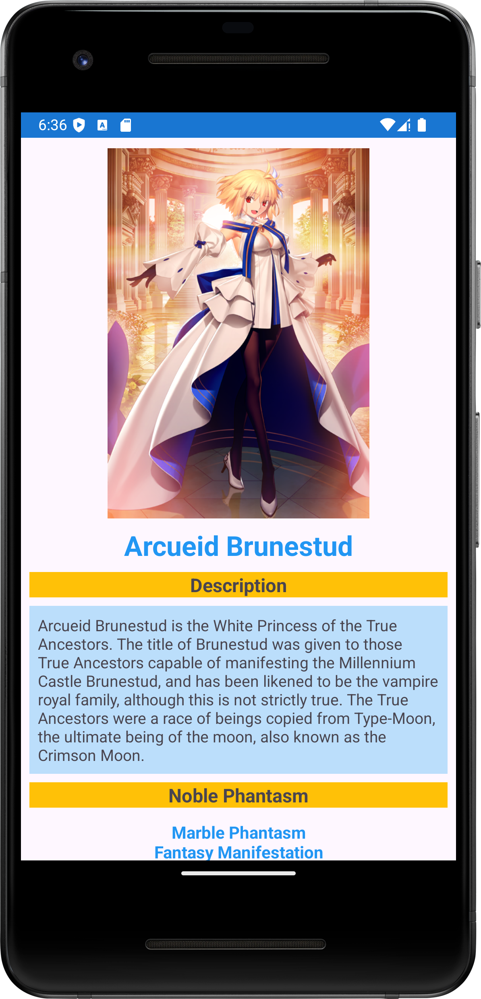
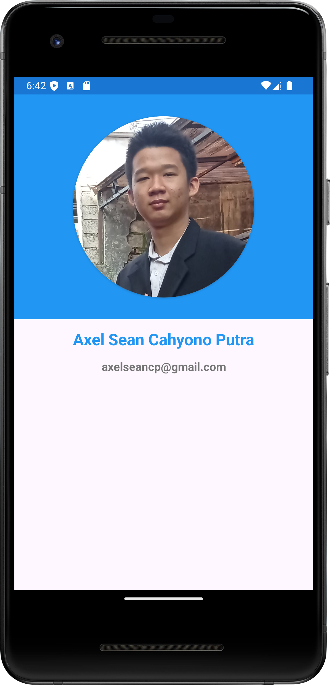
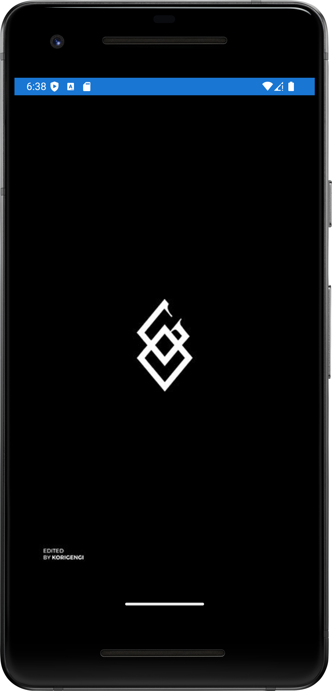

# fgoapk

A Project from Dicoding's Android Beginner Class. An Application to View Servant's Info From A Mobile Game Fate-Grand/Order

# Project Features

## Main Page

- Displays a list of images in a RecyclerView with a minimum of 10 unique items.
- Each item shows:
  - Title of the article
  - Overview of the article (optional)
- Navigates to a detail page when an item is clicked.

## Detail Page

- Shows relevant images and information for the selected item.
- Includes:
  - Title and image corresponding to the list item.
  - Extended description or additional information.
- Utilizes a ScrollView to maintain visibility during orientation changes.

## About Page

- Displays personal photo, name, and registered email from Dicoding.
- Accessible via a button linked to the About page using an element with ID `about_page`.

## UI Standards

- Adheres to application layout standards:
  - Proper width, height, margins, and padding.
  - Components are not overlapping.
  - Appropriate use of components.
  - Consistent color usage.
  - Data visibility in both landscape and portrait orientations (using ScrollView).

## Additional Features

- Implements a custom splash screen.

  

- Uses CardView for displaying list content.
- Implements a Share functionality on the detail page.
